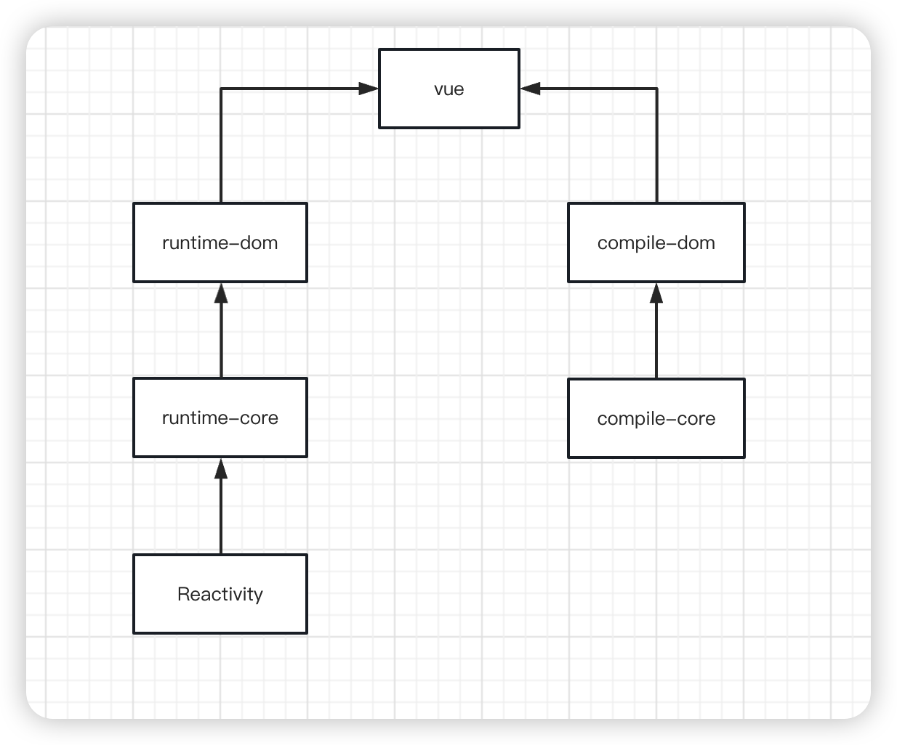
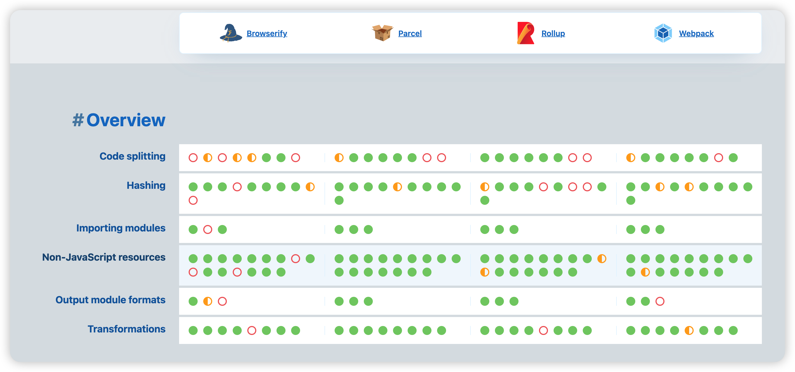

**Nothing is unachievable**

<!-- more -->

关于 `vue` 整个项目可以学到的还是挺多的, 我所学的可能是`某一段代码`让现在的我`耳目一新`

## Monorepo

先了解一下 `Monorepo(monolithic repository)`, 在版本控制系统的`单个代码库`里包含了`许多项目`的代码。这些项目虽然有`可能是相关`的,但通常在`逻辑上是独立`的,并由不同的团队维护

::: info 为啥会出现 `Monorepo` 这个概念呢?

首先我们希望`调试`时`所有`的代码都在源码中, 但实际情况可能会 因为 多源仓库, 多 npm 包管理, 调试的时候我们需要一个一个去 `npm link`, 下面大概列举下:

1. 管理, 调试困难
   多个 git 仓库管理起来天然是麻烦的, 对于功能类似的模块, 如果拆成了多个仓库, 无论对于多人协作还是独立开发, 都需要打开多个仓库页面
   虽然 vscode 通过 `Workspaces` 解决多仓库管理的问题, 但在多人协作的场景下, 无法保证每个人的环境配置一致
   对于共用的包通过 `npm` 安装, 如果不能接受调试编译后的代码, 或每次 `npm link` 一下, 就没有办法调试依赖的子包
2. 分支管理混乱
   假如一个仓库提供给 A、B 两个项目用, 而 B 项目优先开发了功能 b, 无法与 A 项目兼容, 此时就要在这个仓库开一个 feature/b 的分支支持这个功能, 并且在未来合并到主干同步到项目 A
   一旦需要开分支的组件变多了, 且之间出来依赖关联, 分支管理复杂度就会呈指数上升
3. 依赖关系复杂
   独立仓库间组件版本号的维护需要手动操作, 因为源代码不在一起, 所以没有办法整体分析依赖, 自动化管理版本号的依赖
4. 三方依赖版本可能不一致
   一个独立的包拥有一套独立的开发环境, 难以保证子模块的版本和主项目完全一致, 就存在运行结果不一致的风险
5. 占用总空间大
   正常情况下,一个公司的业务项目只有一个主干, 多 `git repo `的方式浪费了大量存储空间重复安装比如 React 等大型模块,时间久了可能会占用几十 GB 的额外空间
6. 不利于团队协作
   一个大项目可能会用到数百个二方包, 不同二方包的维护频率不同, 权限不同, 仓库位置也不同, 主仓库对它们的依赖方式也不同
   一旦其中一个包进行了非正常改动, 就会影响到整个项目, 而我们精力有限, 只盯着主仓库, 往往会栽在不起眼的二方包发布上

:::

所以 `Monorepo` 就是为了解决上面的问题, 对比下来优点如下:

::: info 优点

1. 可见性
   每个人都可以看到其他人的代码, 这样可以带来更好的协作和跨团队贡献——不同团队的开发人员都可以修复代码中的 bug, 而你甚至都不知道这个 bug 的存在
2. 更简单的依赖关系管理
   共享依赖关系很简单, 因为所有模块都托管在同一个存储库中, 因此都不需要包管理器
3. 唯一依赖源
   每个依赖只有一个版本,意味着没有版本冲突,没有依赖地狱
4. 一致性
   所有代码库放在一个地方, 执行代码质量标准和统一的风格会更容易
5. 共享时间线
   API 或共享库的变更会立即被暴露出来, 迫使不同团队提前沟通合作
6. 原子提交
   原子提交使大规模重构更容易, 开发人员可以在一次提交中更新多个包或项目
7. 统一的 CI/CD
   可以为代码库中的每个项目使用相同的 `CI/CD` 部署流程
8. 统一的构建流程
   代码库中的每个应用程序可以共享一致的构建流程

:::

当然也有着缺点

::: info 缺点

1. 学习曲线
   代码库包含了许多紧密耦合的项目, 那么新成员的学习曲线会更陡峭
2. 大量的数据
   单一代码库每天都要处理大量的数据和提交
3. 所有权
   维护文件的所有权更有挑战性, 因为像 `Git` 或 Mercurial 这样的系统没有内置的目录权限
4. Code reviews
   通知可能会变得非常嘈杂

:::

### 当前常用的包管理有下面几个

1. Lerna
2. Yarn workspace
3. Pnpm workspace (vue3.x)

### Pnpm workspace

众所周知, vue3.x 核心的几个包 分别是 `reactivity`, `runtime-core`, `runtime-dom`, `compile-core`, `compile-dom`


为了方便管理, 尤大使用的是 [pnpm workspace](https://pnpm.io/zh/workspaces)

我们只需要创建一个 `pnpm-workspace.yaml` 文件, 内容如下:

```yaml
packages:
  - 'packages/*'
```

一个 `momorepo` 就已经好了

## Rollup

当前主流的打包工具 `Browserify`, `Parcel`, `Rollup`, `Webpack`, 那么我们实现一个公共库, 需要考虑的维度有哪些呢?

1. Code Splitting
   即代码分割, 这意味着在构建打包时, 能够导出公共模块, 避免重复打包, 以及在页面加载运行时, 实现最合理的按需加载策略,
   `Code Splitting` 是现代化构建工具的标配, 因为它直接决定了前端的`静态资源产出情况`, 影响着项`目应用的性能表现`
2. Hashing
   即对打包资源进行版本信息映射, 我们知道有效的缓存策略将直接影响页面加载表现, 决定用户体验, 那么对于构建工具来说, 为了实现更合理的 `hash` 机制, 构建工具就需要分析各种打包资源, 导出模块间依赖关系, 依据依赖关系上下文决定产出包的哈希值, 构建工具进行打包的前提就是对各个模块依赖关系进行分析, 并根据依赖关系, 支持开发者自行定义哈希策略
3. Importing Modules
   即依赖机制, 因为历史和设计原因,前端开发者一般要面对包括 ESM、CommonJS 等不同模块化方案
4. Non-JavaScript Resources
   是指对其他非 JavaScript 类型资源导入的支持能力
5. Output Module Formats
   构建输出内容的模块化方式也需要更加灵活, 比如开发者可配置 ESM、CommonJS 等规范的构建内容导出
6. Transformations
   现代化前端开发离不开编译/转义过程, 比如对 JavaScript 代码的压缩、对无用代码的删除(DCE)等

下面是各个打包工具的对比



- 是一个库不是业务项目
- 工具配置简介, 打包产物可读性高
- 原生支持 ESM

所以选择 [Rollup](https://rollupjs.org/)

因为 `Monorepo` 可以统一 打包/发布 流程

下面我们来看看 `vue3.x` 的 打包流程

### build

```javascript
async function build(target) {
  // 省略代码
  await execa(
    'rollup',
    [
      '-c',
      '--environment',
      [
        `COMMIT:${commit}`,
        `NODE_ENV:${env}`,
        `TARGET:${target}`,
        formats ? `FORMATS:${formats}` : ``,
        prodOnly ? `PROD_ONLY:true` : ``,
        sourceMap ? `SOURCE_MAP:true` : ``,
      ]
        .filter(Boolean)
        .join(','),
    ],
    { stdio: 'inherit' },
  );
}
```

主要就是使用 `execa` 来执行命令行, 其中 有个 `-c` 是 `--config` 的 `alias`

我们找到对应的 `rollup.config.xx`

::: note rollup.config.js

`rollup` 的 配置文件 可以导出`一个对象` 或者 `一个数组`

一个简单的 `rollupConfigObject`, 可以只有 `input`, 与 `output`

如果项目中用到了 `typescript`, 你需要使用 `plugins` 来支持 (通过插件来支持很多功能, 比如还有 `alias`)

如果有的依赖不希望被打包进来, 可以使用 `external`

常用的

```javascript
// rollup.config.js
export default {
  external, // 忽略打包的 依赖
  input, // 入口
  plugins, // 插件

  // 可以是数组 也可以是对象
  output: {
    file, // 出口文件
    format, // 打包的格式
    globals, // 导出全局的
    name, // 文件名
    plugins, // 插件
    banner, // 开头的info
    footer, // 末尾的info
    sourcemap, // sourcemap
  },
};
```

:::

::: code-tabs

@tab config

```javascript
const packageConfigs = packageFormats.map((format) =>
  createConfig(format, outputConfigs[format]),
);

if (process.env.NODE_ENV === 'production') {
  packageFormats.forEach((format) => {
    if (packageOptions.prod === false) {
      return;
    }
    if (format === 'cjs') {
      // 当做生成环境
      packageConfigs.push(createProductionConfig(format));
    }
    if (/^(global|esm-browser)(-runtime)?/.test(format)) {
      // 需要被压缩代码的
      packageConfigs.push(createMinifiedConfig(format));
    }
  });
}

export default packageConfigs;
```

@tab packageFormats

```javascript
const resolve = (p) => path.resolve(packageDir, p);
const pkg = require(resolve(`package.json`)); // 获取对应的 package.json
const packageOptions = pkg.buildOptions || {}; // 获取buildOptions
const defaultFormats = ['esm-bundler', 'cjs']; // 默认的 formats
const inlineFormats = process.env.FORMATS && process.env.FORMATS.split(','); // pnpm run build -f xxx
const packageFormats =
  inlineFormats || packageOptions.formats || defaultFormats; // 赋值
```

@tab vue/package.json

```json
{
  "buildOptions": {
    "name": "Vue",
    "formats": [
      "esm-bundler",
      "esm-bundler-runtime",
      "cjs",
      "global",
      "global-runtime",
      "esm-browser",
      "esm-browser-runtime"
    ]
  }
}
```

:::

### createConfig

::: code-tabs

@tab createConfig

```javascript
function createConfig(format, output, plugins = []) {
  /**
   * 省略代码
   * 处理 每个环境 对应的标识
   * 处理 Output
   * 处理 external
   * ...
   */
  return {
    input: resolve(entryFile),
    external: resolveExternal(),
    plugins: [
      json({
        namedExports: false,
      }),
      alias({
        entries,
      }),
      enumPlugin,
      ...resolveReplace(),
      esbuild({
        /** */
      }),
      ...resolveNodePlugins(),
      ...plugins,
    ],
    output,
    onwarn: (msg, warn) => {
      if (!/Circular/.test(msg)) {
        warn(msg);
      }
    },
    treeshake: {
      moduleSideEffects: false,
    },
  };
}
```

@tab createProductionConfig

```javascript
function createProductionConfig(format) {
  return createConfig(format, {
    file: resolve(`dist/${name}.${format}.prod.js`),
    format: outputConfigs[format].format,
  });
}
```

@tab createMinifiedConfig

```javascript
function createMinifiedConfig(format) {
  return createConfig(
    format,
    {
      file: outputConfigs[format].file.replace(/\.js$/, '.prod.js'),
      format: outputConfigs[format].format,
    },
    [
      terser({
        module: /^esm/.test(format),
        compress: {
          ecma: 2015,
          pure_getters: true,
        },
        safari10: true,
      }),
    ],
  );
}
```

:::

### 最大并行执行

最明显的好处就是 最大限度利用好计算机资源

大概意思就是 最大并行数量 是 8

我们需要保证 同时执行的 方法数量 刚刚也是 8

```javascript
/**
 * maxConcurrency 最大并行的数量
 * targets 被执行的资源数组
 * iteratorFn 处理资源的方法
 */
async function runParallel(maxConcurrency, source, iteratorFn) {
  const ret = []; // 结果数组
  const executing = []; // 并行执行的任务池
  // 遍历任务
  for (const item of source) {
    // 注册异步 执行 处理资源的函数
    const p = Promise.resolve().then(() => iteratorFn(item, source));
    // 添加进结果数组
    ret.push(p);

    // 如果我们处理的资源数组长度其实并没有超过 计算机当前可并行的执行的数量时, 我们是没必要去处理的
    if (maxConcurrency <= source.length) {
      // 注册异步 为了执行完 在 并行池 中删除当前已经执行的
      const e = p.then(() => executing.splice(executing.indexOf(e), 1));
      // 添加进并行池
      executing.push(e);
      // 当并行池 的长度 与 最大并行的数量 大于等于时 需要释放并行池, 也就是执行 并行池中的 promise
      if (executing.length >= maxConcurrency) {
        // 使用 Promise.race
        await Promise.race(executing);
      }
    }
  }
  // 这里其实保证的就是 ret 中未完成的 Promise 等于 最大并行数量
  return Promise.all(ret);
}
```

用到知识点很多的:

1. EventLoop
   js 先执行同步任务, 再执行异步任务, 异步任务又可分为宏任务跟微任务
   第一次事件循环中, 将所有代码推入到执行栈中, 然后执行,执行过程中, 将宏任务推入到宏任务队列中, 将微任务推入到微任务队列中
   当第一次事件循环中的执行栈为空时, 就去执行微任务队列中的事件, 微任务队列为空时开始第二次事件循环
   同步任务执行完 => 会去执行微任务队列中的(Promise, MutationObserver) => 会去执行宏任务队列中的(setTimeout, setInterval)
2. for ... of / for ... in
   前者是`值`, 后者是 `key`
   前者不会返回原型链上的值 , 后者会返回原型链上的 `可枚举` 属性
   前置是`ES6`, 后者是`ES5`
3. Promise.race
   传入一个 `Promise` 数组, 谁先状态改变就返回哪个
4. Promise.all
   插入一个 `Promise` 数组, 都成功的话就会返回成功 `reason` 数组, 有一个立即调用失败函数, 那么 Promise.all 将立即变为失败

### 顺序执行

```javascript
const run = (targets) => {
  let index = 0;
  const total = targets.length;
  const next = () => {
    build(targets[index]).then(() => {
      index++;
      if (index < total) {
        next();
      }
    });
  };
};

const build = ({ name, time }) => {
  return new Promise((resolve) => {
    setTimeout(() => {
      console.log('name', name);
    }, time);
  });
};
```
